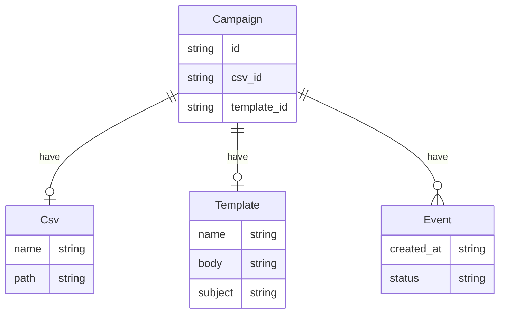

# Mailmerger Server

A server for Mailmerger

Run server:
```
make run-server
```

# ERD

```mermaid
erDiagram
	Campaign ||--o| Csv: have
	Campaign ||--o| Template: have
	Campaign ||--o{ Event: have

	Campaign {
		string id
		string csv_id
		string template_id
	}
	Csv {
		name string
		path string
	}
	Template {
		name string
		body string
		subject string
	}
	Event {
		created_at string
		status string
	}

```