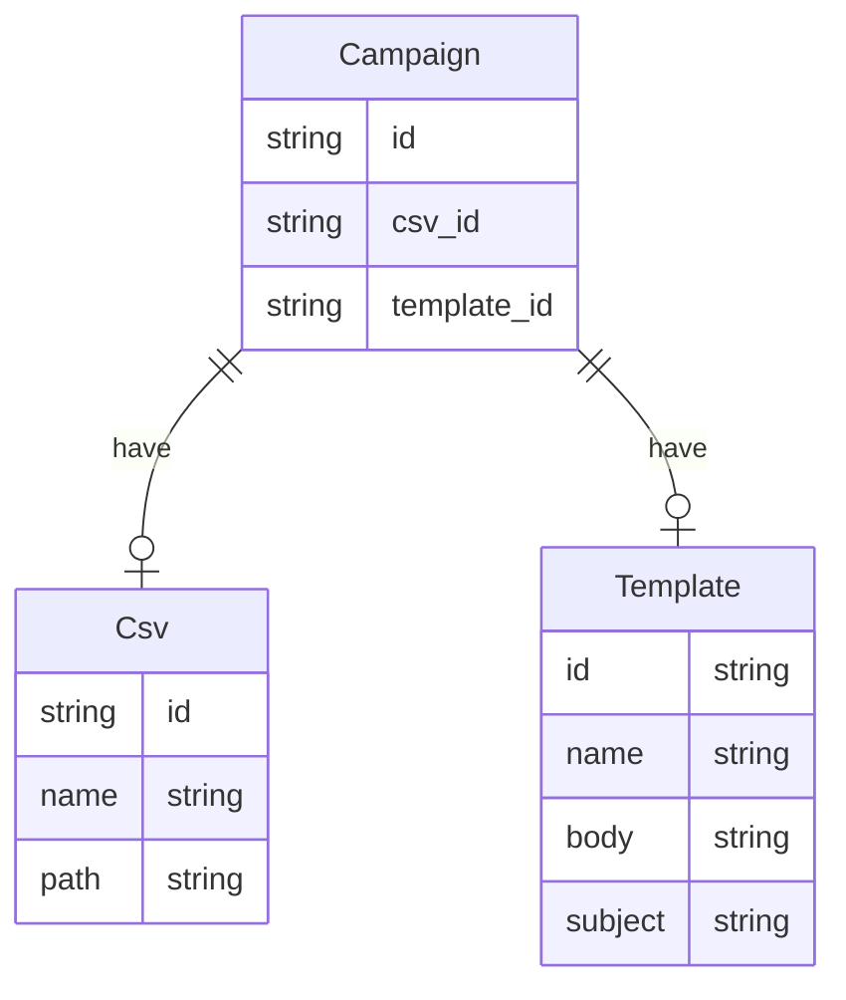

# Mailmerger

Mailmerger, customize your email and send it to all recipients in the csv.

Usage example:
```go

// errors are omitted for simplicity

var csvStr = `email,name,token
john@doe.com,john doe,token1
jean@doe.com,jean doe,token2
han@doe.com,han doe,token3
`

var bodyTmpl = `
	Selamat pagi {{ name | lower | title }}
	Berikut adalah token registrasi yang dapat dipakai {{ token }}
`

var subjectTmpl = `
	Token Registrasi {{ name | lower | title }}
`

defaultSubject := "Hay there!"
mailer := NewMailer(&MailerConfig{
	SenderEmail:     "test@email.com",
	DefaultSubject:  "Hai there",
	Concurrency:     2,
	Transporter:     mailTransporter,
	CsvSrc:          strings.NewReader(csvStr),
	BodyTemplate:    strings.NewReader(bodyTmpl),
	SubjectTemplate: strings.NewReader(subjectTmpl),
})
mailer.ParseCsv(strings.NewReader(csvStr))
mailer.ParseBodyTemplate(strings.NewReader(bodyTmpl))
mailer.ParseSubjectTemplate(strings.NewReader(subjectTmpl))

err = mailer.SendAll(ctx)
```

# Server

## ERD
