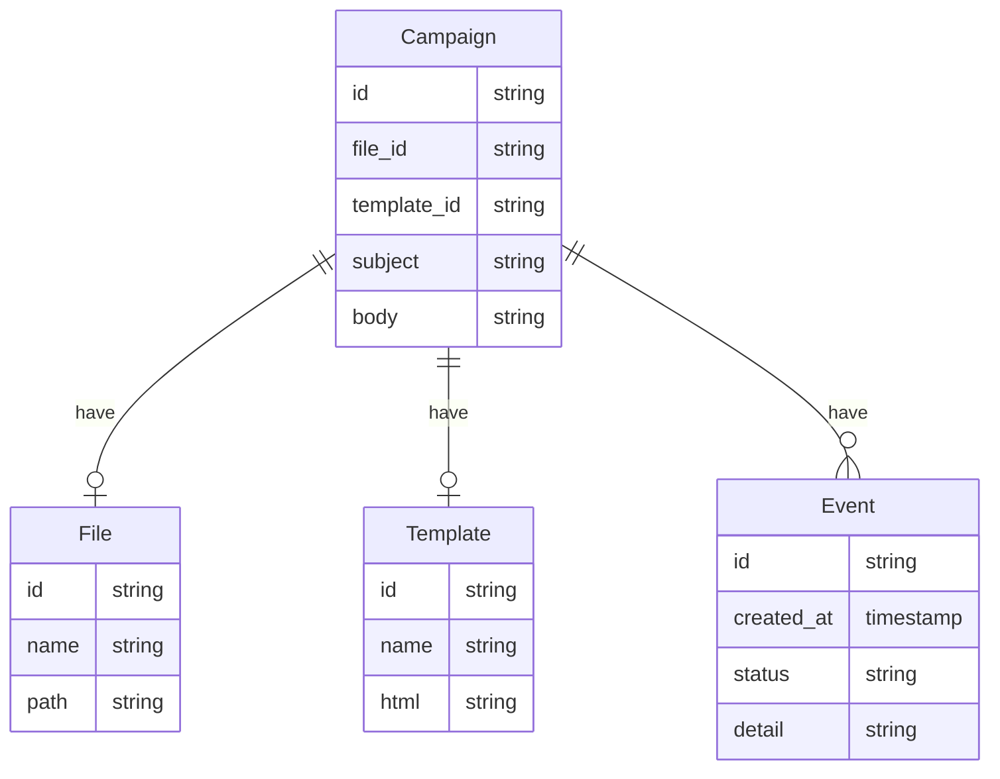
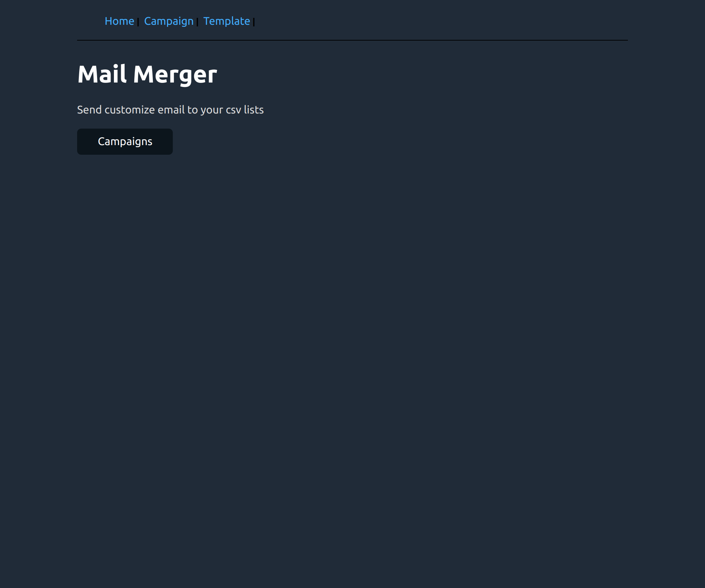
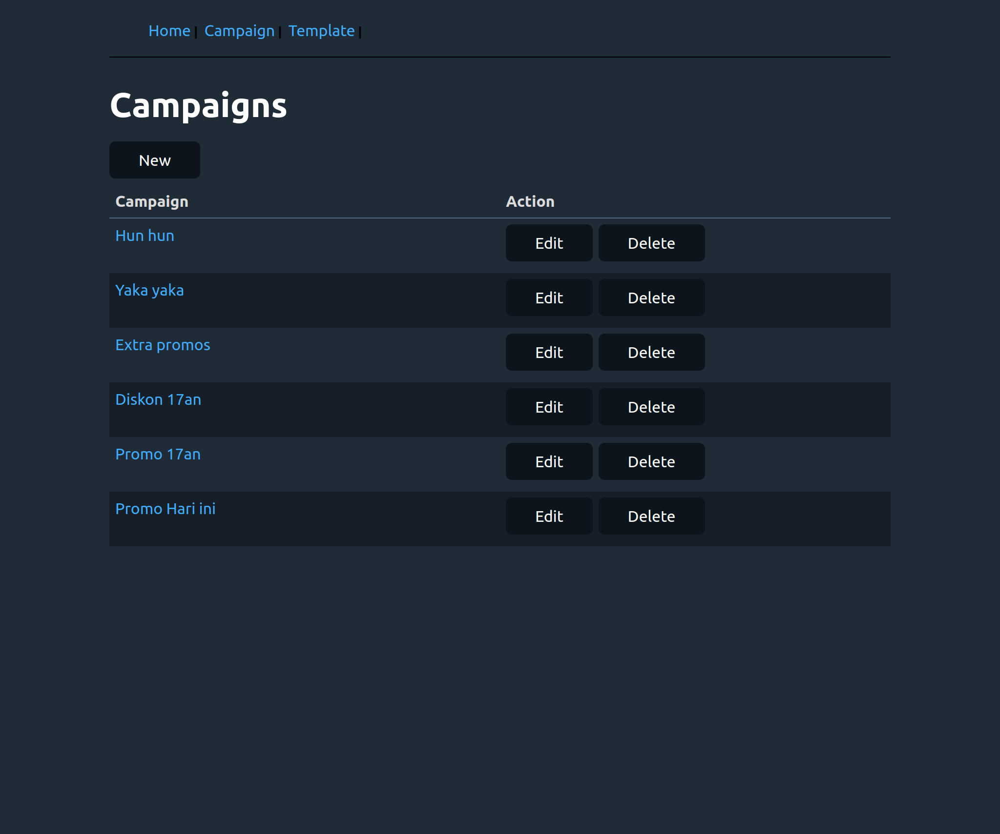
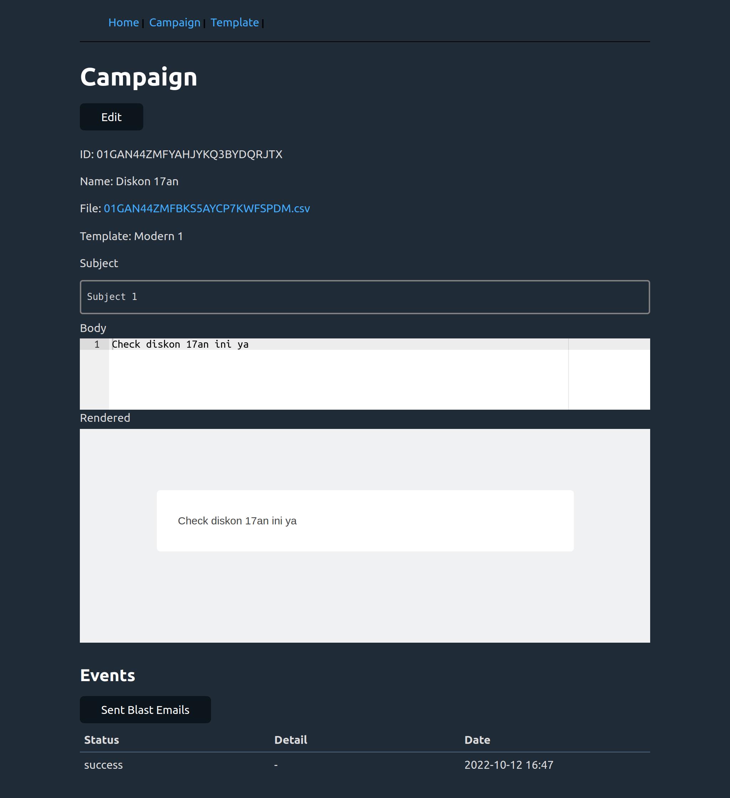
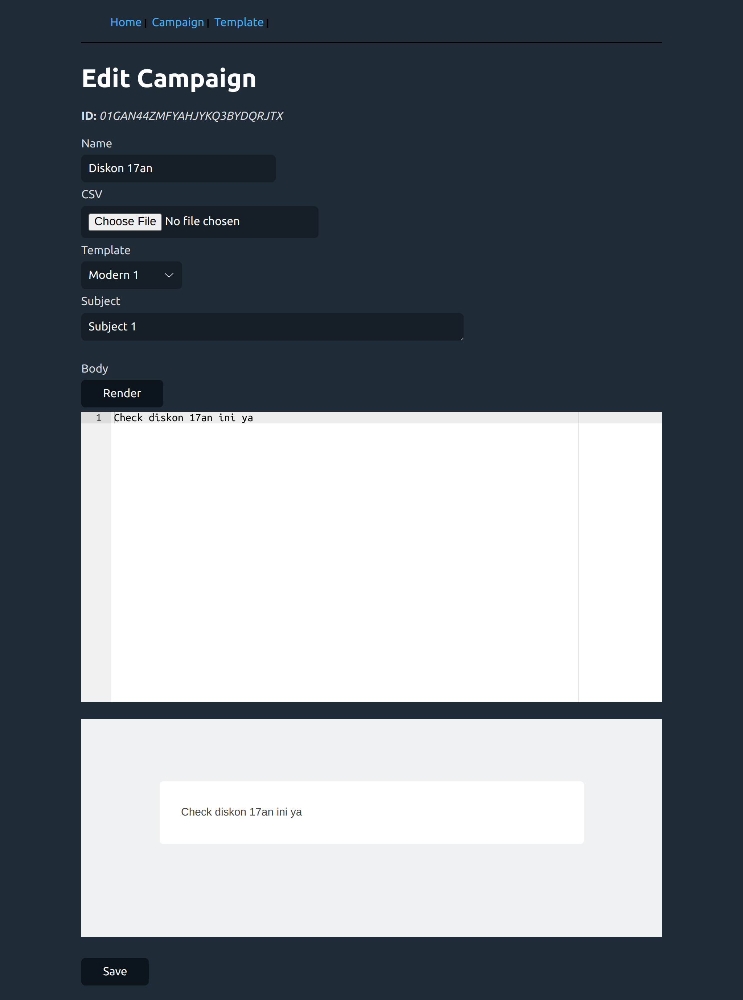
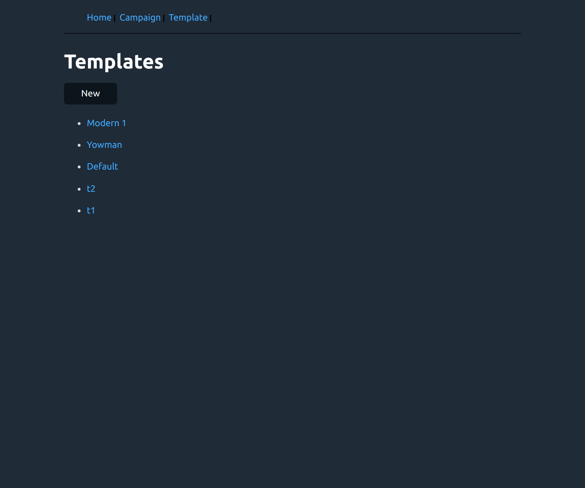
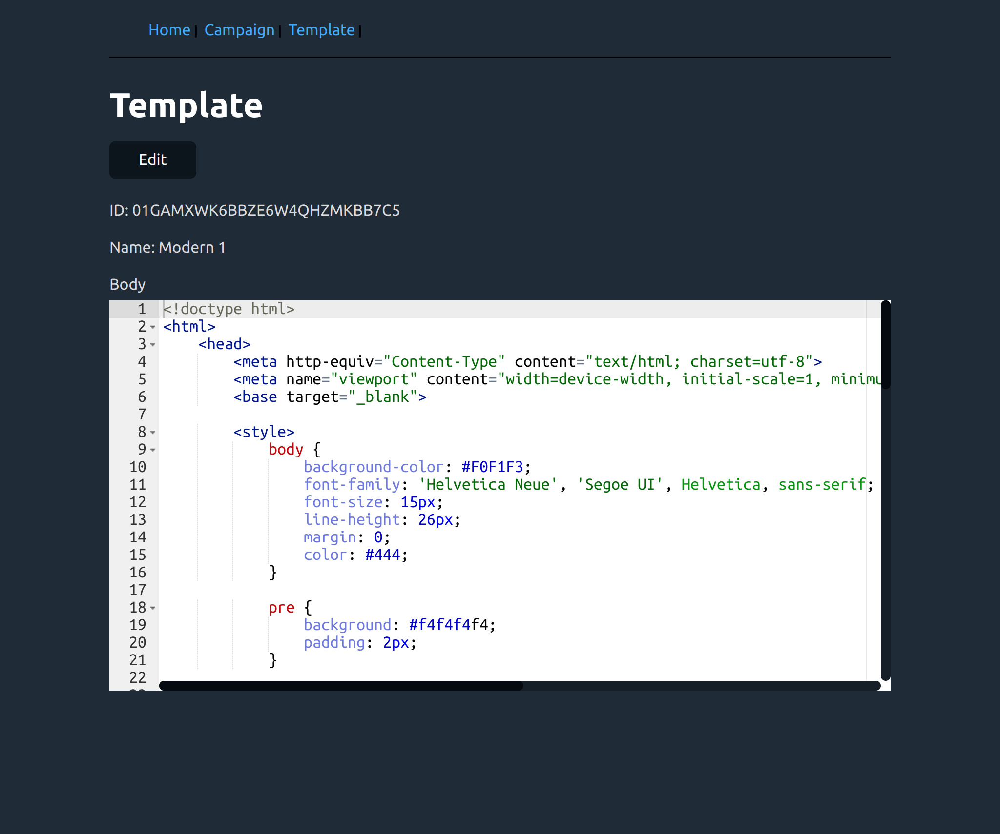
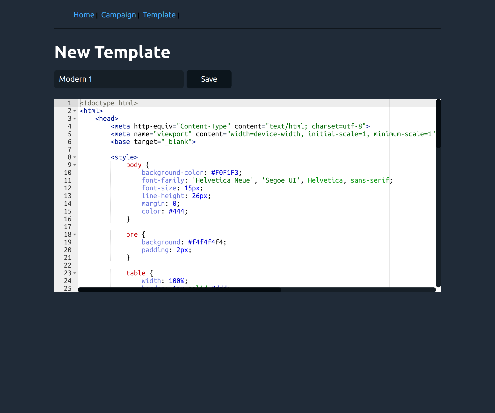

# Mailmerger Server

A server for [Mailmerger](https://github.com/fahmifan/mailmerger)

## Features
- [x] Manage campaigns
- [x] Custom templates
- [x] Preview email templates 
- [x] Blast emails from imported csv files

## Development
Tools to install:
- [rubenv/sql-migrate: SQL schema migration tool for Go.](https://github.com/rubenv/sql-migrate)
- [cortesi/modd: A flexible developer tool that runs processes and responds to filesystem changes](https://github.com/cortesi/modd)
- [Install Docker Engine | Docker Documentation](https://docs.docker.com/engine/install/)

### Start development server
Copy the `example.dbconfig.yml` adjust to your local setup. 

```bash
# run postgres & create the db
make run-dev-postgres
# run schema migration
make migrate-up

# run mailhog the email server
make run-dev-mailhog
# run server using modd
make run-server
```

# ERD


### Pages






